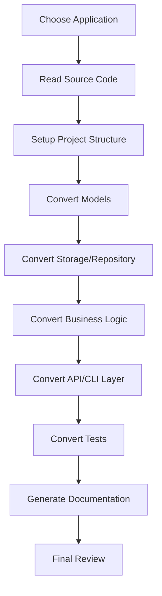

# Convert Framework Workshop

> Learn cross-language code conversion with GitHub Copilot

## 🚀 Quick Start

```bash
# 1. Clone the repo
git clone <your-repo-url>
cd convert-framework

# 2. Try the Go application
cd go/url-shortener
go mod tidy
go run cmd/server/main.go
# → Server at http://localhost:8080

# 3. Try the Python application
cd ../../python/weather-cli
python -m venv venv && source venv/bin/activate
pip install -r requirements.txt
cp .env.example .env  # Add your API keys
python -m weather_cli.cli current "Bangkok"
```

**📱 Quick Commands:**
```bash
make run-url       # Go URL Shortener
make run-weather   # Python Weather CLI
make help          # See all commands
```

**📖 App-Specific Guides:**
- [go/url-shortener/README.md](go/url-shortener/README.md) - REST API with Chi & SQLite
- [python/weather-cli/README.md](python/weather-cli/README.md) - CLI tool with Click & APIs

---

## Overview

เวิร์กช็อปนี้สอนการใช้ GitHub Copilot ช่วยแปลงโค้ดข้ามภาษา (Go ↔ Python) โดยมีแอพพลิเคชั่นตัวอย่างที่มีความซับซ้อนพอสมควร พร้อม patterns, techniques และ best practices สำหรับการ migrate code อย่างมีประสิทธิภาพ

## Workshop Objectives

เรียนรู้:
- 🤖 ใช้ GitHub Copilot แปลงโค้ดข้ามภาษาอย่างมีประสิทธิภาพ
- 🔄 แปลง language idioms, patterns และ type systems
- 🧪 Migrate tests, dependencies และ configuration
- 📚 Best practices สำหรับ cross-language conversion
- ⚡ เทคนิค prompt engineering สำหรับ AI-assisted coding

## Applications

### 1. URL Shortener API (Go → Python) 🔗

**Source:** Go with Chi router + SQLite  
**Target:** Python with FastAPI + SQLAlchemy

**Features:**
- ✅ Shorten URLs with custom short codes
- ✅ Redirect tracking with analytics
- ✅ SQLite-based caching for performance
- ✅ API key authentication
- ✅ RESTful API design

**Complexity:** ⭐⭐⭐ (Medium, 2-3 hours)

**Learn:**
- Go structs → Pydantic models
- Chi router → FastAPI routes
- Go error handling → Python exceptions
- SQLite operations in both languages

---

### 2. Weather CLI Tool (Python → Go) 🌤️

**Source:** Python with Click + Multiple APIs  
**Target:** Go with Cobra CLI

**Features:**
- ✅ Fetch weather from multiple sources
- ✅ Multiple output formats (table, JSON, simple)
- ✅ Favorite locations with SQLite
- ✅ Weather comparison across cities
- ✅ Caching to reduce API calls

**Complexity:** ⭐⭐⭐ (Medium, 2-3 hours)

**Learn:**
- Click CLI → Cobra commands
- Python async → Go goroutines
- Python classes → Go structs with methods
- HTTP clients in both languages

## Project Structure

```
convert-framework/
├── .github/
│   └── copilot-instructions.md    # Copilot configuration
├── go/
│   └── url-shortener/             # Go URL Shortener (source)
│       ├── cmd/server/            # Entry point
│       ├── internal/              # Application logic
│       └── README.md              # Quick start guide
├── python/
│   └── weather-cli/               # Python Weather CLI (source)
│       ├── weather_cli/           # Package code
│       ├── requirements.txt       # Dependencies
│       └── README.md              # Quick start guide
├── docs/                           # Workshop documentation
│   ├── GETTING_STARTED.md         # Setup guide
│   ├── IMPLEMENTATION_PLAN.md     # Detailed implementation guide
│   ├── COPILOT_GUIDE.md           # AI techniques & prompts
│   ├── COPILOT_GUIDE.md          # Copilot techniques & prompts
│   └── WORKSHOP_PROGRESS.md      # Track your progress
└── README.md                       # This file
```

## Getting Started

### Prerequisites

**For All Participants:**
- GitHub Copilot subscription (or trial)
- VS Code with GitHub Copilot extension
- Git installed
- Basic understanding of both Go and Python

**For Go Application:**
- Go 1.21+ installed

**For Python Application:**
- Python 3.11+ installed
- pip and virtualenv
- Free API keys (OpenWeatherMap, WeatherAPI.com)

### Quick Setup

1. **Clone the repository**
   ```bash
   git clone <your-repo-url>
   cd convert-framework
   ```

2. **Setup GitHub Copilot**
   - Install GitHub Copilot extension in VS Code
   - Sign in with your GitHub account
   - Verify Copilot is active (check status bar)

3. **Choose your application**
   - Read [docs/APPLICATION_SELECTION.md](docs/APPLICATION_SELECTION.md)
   - Pick an application based on your interests and time

4. **Read the guides**
   - [docs/IMPLEMENTATION_PLAN.md](docs/IMPLEMENTATION_PLAN.md) - Detailed steps
   - [docs/COPILOT_GUIDE.md](docs/COPILOT_GUIDE.md) - Copilot techniques
   - [.github/copilot-instructions.md](.github/copilot-instructions.md) - Conversion patterns

## Workshop Flow

### Module 1: Setup & Introduction (30 min)
1. ✅ Environment setup
2. ✅ Review source applications
3. ✅ Choose conversion path
4. ✅ Review Copilot basics

### Module 2: Demo Conversion (45 min)
**Instructor demonstrates** converting one module from URL Shortener:
- Convert models (structs → Pydantic)
- Convert storage layer
- Convert one handler
- Copilot techniques walkthrough

### Module 3: Hands-On Conversion (90-120 min)
**You work on your chosen application:**
- Follow checkpoints in IMPLEMENTATION_PLAN.md
- Use techniques from COPILOT_GUIDE.md
- Track progress in WORKSHOP_PROGRESS.md
- Ask for help when stuck

### Module 4: Review & Best Practices (30 min)
1. Review completed conversions
2. Discuss challenges
3. Share Copilot tips
4. Q&A

## Conversion Workflow



## Key Features

### 🤖 AI-Powered Conversion
- Inline suggestions for code translation
- Chat-based explanations and conversions
- Automated test generation
- Documentation generation

### 📚 Comprehensive Guides
- Very detailed implementation plan
- Language-specific prompt templates
- Common patterns and pitfalls
- Real-world examples

### ✅ Progress Tracking
- Structured checklists
- Learning objectives tracking
- Notes and reflections
- Feedback collection

### 🎯 Practical Applications
- Real-world complexity
- Common patterns and frameworks
- Full feature implementations
- Production-ready practices

## Quick Start Commands

### Go Projects

```bash
# URL Shortener
cd go/url-shortener
go mod init github.com/yourusername/url-shortener
go mod tidy
go run cmd/server/main.go

# Blog API
cd go/blog-api
go mod init github.com/yourusername/blog-api
go mod tidy
go run cmd/server/main.go
```

### Python Projects

```bash
# Weather CLI
cd python/weather-cli
python -m venv venv
source venv/bin/activate  # or `venv\Scripts\activate` on Windows
pip install -r requirements.txt
python -m weather_cli current "Bangkok"

# Web Scraper
cd python/web-scraper
python -m venv venv
source venv/bin/activate
pip install -r requirements.txt
python -m web_scraper --config example_config.yaml
```

## Learning Resources

### Documentation
- [IMPLEMENTATION_PLAN.md](IMPLEMENTATION_PLAN.md) - Step-by-step conversion guide
- [APPLICATION_SELECTION.md](APPLICATION_SELECTION.md) - Choose the right app
- [COPILOT_GUIDE.md](COPILOT_GUIDE.md) - Copilot tips & techniques
- [WORKSHOP_PROGRESS.md](WORKSHOP_PROGRESS.md) - Track your progress

### External Resources
- [Go Documentation](https://go.dev/doc/)
- [Python Documentation](https://docs.python.org/3/)
- [GitHub Copilot Documentation](https://docs.github.com/en/copilot)
- [FastAPI Documentation](https://fastapi.tiangolo.com/)
- [Django REST Framework](https://www.django-rest-framework.org/)

## Common Conversions

### Go → Python
| Go Pattern | Python Equivalent |
|------------|-------------------|
| `struct` | `dataclass` or `Pydantic model` |
| `interface` | `Protocol` or `ABC` |
| `error returns` | `exceptions` |
| `goroutines` | `asyncio tasks` |
| `defer` | `context managers` |
| `Chi/Gin` | `FastAPI/Django` |

### Python → Go
| Python Pattern | Go Equivalent |
|----------------|---------------|
| `class` | `struct` with methods |
| `async/await` | `goroutines` |
| `exceptions` | `error returns` |
| `decorators` | function wrappers |
| `context managers` | `defer` |
| `Click/argparse` | `Cobra` |

## Tips for Success

1. ✅ **Read First** - เข้าใจโค้ดต้นฉบับก่อนแปลง
2. ✅ **Go Slow** - Convert ทีละ module
3. ✅ **Test Often** - Run tests หลังแปลงแต่ละส่วน
4. ✅ **Use Copilot** - แต่อ่านและเข้าใจก่อน accept
5. ✅ **Ask Questions** - ใช้ Copilot Chat เมื่อติดปัญหา
6. ✅ **Stay Idiomatic** - เขียนโค้ดที่เป็นธรรมชาติในภาษาปลายทาง
7. ✅ **Document** - อธิบายการเปลี่ยนแปลงที่สำคัญ
8. ✅ **Track Progress** - อัพเดท WORKSHOP_PROGRESS.md

## Troubleshooting

### Copilot Not Working?
- Check Copilot status in VS Code status bar
- Restart VS Code
- Check your GitHub Copilot subscription
- Try `Cmd+Shift+P` → "Reload Window"

### Conversion Stuck?
- Review [COPILOT_GUIDE.md](COPILOT_GUIDE.md) for techniques
- Use Copilot Chat to ask for help
- Check [IMPLEMENTATION_PLAN.md](IMPLEMENTATION_PLAN.md) for detailed steps
- Ask the instructor

### Tests Failing?
- Compare with original behavior
- Check error messages carefully
- Use `/fix` in Copilot Chat
- Review conversion of error handling

## Contributing

Found an issue or have a suggestion?
1. Check existing issues
2. Create a new issue with details
3. Submit a pull request (if applicable)

## License

This workshop material is provided for educational purposes.

## Credits

Created for GitHub Copilot Workshop - Convert Framework  
Demonstrating cross-language code conversion with AI assistance

---

## Next Steps

1. 📖 Read [APPLICATION_SELECTION.md](APPLICATION_SELECTION.md) to choose your app
2. 📝 Review [IMPLEMENTATION_PLAN.md](IMPLEMENTATION_PLAN.md) for detailed steps
3. 🤖 Study [COPILOT_GUIDE.md](COPILOT_GUIDE.md) for techniques
4. 🚀 Start converting!
5. ✅ Track progress in [WORKSHOP_PROGRESS.md](WORKSHOP_PROGRESS.md)

**Happy Converting! 🎉**
